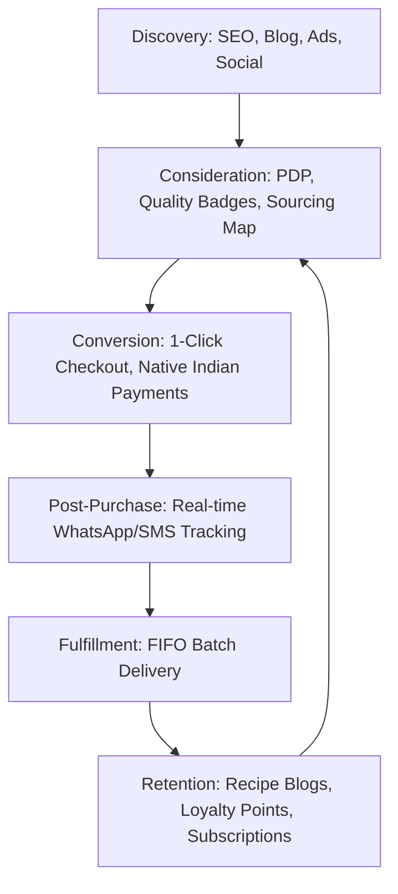

# Product Requirements Document (PRD)

## Project: Enterprise-Grade Ecommerce Platform for MR. BHARATH FOODS
**Document Version:** 1.0.0  
**Author:** Senior Product Architect & Enterprise Ecommerce Consultant  
**Date:** June 6, 2026  
**Status:** Draft / Pending Review  

---

### Executive Summary

MR. BHARATH FOODS is a long-term Indian food brand representing **Trust, Quality, Responsibility, Indian Heritage, and Corporate Professionalism**. 

The company's core business model is built around curation and selection: it does not manufacture products initially, but partners with trusted manufacturing partners, evaluates their products against strict quality benchmarks, and sells them under the MR. BHARATH FOODS brand. The brand positioning is: **"Selecting the Best to Serve the Best"**.

This Product Requirements Document (PRD) outlines the specifications for building an enterprise-grade ecommerce platform. The platform is designed to launch with current Ghee products (**Rasipuram Ghee** and **Uthukuli Ghee**) and scale seamlessly to support future categories (Oils, Honey, Rice, Spices, Traditional Foods, and Health Foods).

---

## 1. Business Goals

The ecommerce platform must achieve the following business objectives:

1. **Brand Launch & D2C Market Entry**: Establish a premium, trusted digital storefront that showcases the brand’s quality ethos and heritage.
2. **Quality & Sourcing Transparency**: Build trust by demonstrating the selection process, lab test certifications, and manufacturer compliance directly to consumers.
3. **SKU Scalability**: Support rapid SKU expansion from 2 current SKUs to hundreds across diverse future categories without necessitating structural platform re-engineering.
4. **Customer Lifetime Value (LTV) & Recurring Revenue**: Cultivate recurring subscriptions for kitchen staples (ghee, oil, rice) to maximize LTV and reduce customer acquisition costs (CAC).
5. **Corporate and B2B Enablement**: Capture corporate gifting, bulk ordering, and retail inquiries directly from day one.
6. **Key Performance Indicators (KPIs) Targets**:
   - **Average Order Value (AOV)**: Target ₹800+ in Year 1.
   - **Cart Abandonment Rate**: Under 60% via optimized checkouts.
   - **Repeat Purchase Rate**: Target 35% within 180 days, driven by subscription and retention strategies.
   - **Return to Origin (RTO) Rate**: Keep below 8% for Cash on Delivery (COD) orders.

---

## 2. User Types

The platform must support six primary user personas with distinct permissions and interfaces:

| User Role | Description | Access Level | Key Responsibilities |
| :--- | :--- | :--- | :--- |
| **Guest Visitor** | Unregistered browser. | Public Frontend | Browse products, read blogs, view quality certificates, guest checkout. |
| **Registered Customer** | Logged-in customer. | Customer Portal | Manage addresses, view order history, track shipments, manage subscriptions, redeem loyalty points. |
| **Store Manager (Admin)** | Core operations lead. | Admin Panel (Full) | Catalog management, content (CMS) publishing, discount configuration, financial reporting. |
| **Logistics/Warehouse Manager**| Fulfillment lead. | Admin Panel (Logistics) | Stock management, 3PL dispatching, batch code assignments, packing slips, tracking updates. |
| **Customer Support Agent** | Customer service representative.| Admin Panel (Support) | Process refunds, edit customer details, modify active subscriptions, view customer tickets. |
| **Quality Auditor** | Internal/External Inspector. | Admin Panel (QA Logs) | Upload laboratory certificates, audit partner facilities, manage batch trace codes. |

---

## 3. Customer Journey

The ecommerce platform will facilitate a friction-free, trust-building journey:



### 3.1. Discovery
- **Action**: User arrives via blog posts on traditional foods, SEO search results, or targeted social media campaigns.
- **Experience**: The user is welcomed by a premium, fast-loading, visually rich storefront highlighting Indian heritage combined with clean corporate styling.

### 3.2. Consideration
- **Action**: User visits Product Detail Pages (PDP) for Rasipuram or Uthukuli Ghee.
- **Experience**: The user reviews detailed product sourcing stories, notes the FSSAI license numbers, views the downloadable lab purity report for the active batch, and reads verified buyer reviews with photos.

### 3.3. Conversion
- **Action**: User decides to purchase and adds items to their cart.
- **Experience**: They are prompted with a fast 1-click checkout option (supporting UPI, Cards, and NetBanking) or a secure COD verification flow.

### 3.4. Post-Purchase & Fulfillment
- **Action**: Order is created, packed, and shipped.
- **Experience**: The user receives instant order confirmation and tracking details via WhatsApp, SMS, and Email. The package is delivered containing batch traceability information.

### 3.5. Retention & Advocacy
- **Action**: Customer uses the product and returns to the store.
- **Experience**: They receive post-purchase emails with traditional recipes using Uthukuli Ghee, receive loyalty points, and sign up for a monthly Ghee subscription.

---

## 4. Site Structure & Information Architecture

The website will utilize a semantic, highly structured layout optimized for navigation, accessibility, and conversion:

```
├── Homepage (Brand Story, Curated Highlights, Quality Ethos)
├── Product Catalog (Category Listing Page - CLP)
│   ├── Ghee (Rasipuram, Uthukuli, future variants)
│   ├── Traditional Oils (Future category)
│   ├── Honey & Natural Sweeteners (Future category)
│   ├── Heritage Rice & Grains (Future category)
│   ├── Handpicked Spices (Future category)
│   └── Traditional & Health Foods (Future category)
├── Individual Product Detail Pages (PDP)
│   └── Dynamic tabs: Description, Sourcing, Lab Certificates, Reviews
├── Our Selection Process (Brand Trust & Quality Assurance Page)
│   └── Sourcing Map, Compliance Standards, Partner Verification
├── Wellness & Heritage Blog
│   ├── Category: Traditional Recipes
│   ├── Category: Nutritional Science & Ayurveda
│   └── Category: Farmer & Partner Spotlights
├── Customer Account Portal
│   ├── Dashboard & Order History
│   ├── Subscription Manager
│   └── "Bharath Points" Loyalty Ledger
├── Checkout Flow (Cart → Shipping/Billing → Secure Payment Gateway)
└── Utility Pages
    ├── Contact Us (with Corporate Gifting form)
    ├── FAQs & Help Center
    └── Legal: Privacy Policy, Terms of Service, Shipping & Return Policy, FSSAI Disclosures
```

---

## 5. Core Ecommerce Features

To deliver a premium, high-converting D2C experience, the platform must include:

### 5.1. Smart Product Search & Filtering
- **Fuzzy Search & Auto-Suggest**: Understands typos (e.g., "Utukuli" matches Uthukuli) and suggests popular categories.
- **Faceted Navigation**: Filter by region (e.g., Rasipuram, Uthukuli), dietary profile (A2, organic, grass-fed), pack size (250ml, 500ml, 1L), and price range.

### 5.2. Adaptive Bundling & Tiered Pricing
- **Dynamic Bundles**: Combine products (e.g., "Traditional Kitchen Starter Kit" containing Ghee and future Cold-Pressed Oils) for a package discount.
- **Quantity Tier Discounts**: Buy more, save more pricing visible on the PDP (e.g., 5% off for 2 units, 10% off for 4+ units).

### 5.3. Staple Subscription Engine
- **Flexible Cadences**: Customers can subscribe to recurring deliveries (every 14, 30, 45, or 60 days) with a standard subscription discount (e.g., 10% off).
- **Self-Serve Management**: Pause, skip, or cancel subscriptions directly from the Customer Portal without contacting support.

### 5.4. Sourcing & Quality Interactive Component
- **Traceability Widget**: An interactive feature on the website where users enter the batch number printed on their product jar to view the sourcing farm details, date of production, and lab test results.

### 5.5. "Bharath Points" Loyalty & Referral System
- **Points Ledger**: Earn points per rupee spent, for leaving verified reviews (with bonus points for media), and on birthdays.
- **Referral Loop**: Referral program where both referee and referrer receive discounts.

---

## 6. Future Scalability Requirements

The technical foundation must support rapid catalog growth and spike traffic handling:

### 6.1. Headless & API-First Architecture
- Decouple the frontend (e.g., Next.js hosted on Vercel) from the backend ecommerce engine (e.g., Commerce Layer, Shopify Plus, or MedusaJS).
- Decoupling ensures frontend changes do not disrupt checkout pipelines and allows for rapid scaling of SKUs.

### 6.2. High Traffic and Auto-Scaling
- **Stateless Application Servers**: Deploy backend instances in auto-scaling groups triggered by CPU/Memory thresholds.
- **Database Scaling**: Set up read-replicas for catalog searches, keeping the primary write database dedicated to checkouts.
- **Festival Traffic Mitigation**: Auto-cache static content globally using CDNs (Cloudflare/Fastly) to handle 10x traffic spikes during Indian festive seasons (Diwali, Pongal).

### 6.3. Multi-Location Inventory & Fulfillment Routing
- Plan logic for multi-warehouse shipping: Route orders to the closest fulfillment partner or third-party logistics (3PL) hub (e.g., South Zone, North Zone) to lower shipping costs and transit times.

---

## 7. Product Catalog Requirements

To scale the product list from 2 to dozens of categories, the Product Information Management (PIM) schema must be flexible and dynamic.

### 7.1. Dynamic Product Schema & Attributes
Each product must map to standard attributes plus category-specific metadata fields:

| Category | Specific Attributes Required |
| :--- | :--- |
| **Ghee** | Cattle Type (Cow/Buffalo), Breed (A2/Gir), Clarification Temp, Solidification Profile. |
| **Traditional Oils** | Extraction Method (Cold-Pressed/Wood-Pressed), Seed Source, Smoking Point. |
| **Honey** | Flora Origin (Neem, Tulsi, Wildflower), Moisture %, Pollen Count. |
| **Rice & Grains** | Age (e.g., Aged 2 Years), Type (Raw/Boiled), Grain Length, Glycemic Index. |
| **Spices** | Curcumin Content (for Turmeric), Piperine Content (for Pepper), Essential Oil %, Grade. |
| **Traditional Foods** | Frying instructions, shelf life parameters, allergen warnings. |

### 7.2. Laboratory Certificate Mapping
- Admin must be able to link PDF documents (lab certifications/Agmark approvals) to specific inventory batches.
- On the PDP, the system will dynamically pull and display the certificate of the currently shipping batch.

---

## 8. Checkout Requirements

The checkout process must be optimized for the Indian demographic, with a focus on speed and mobile checkout.

### 8.1. 1-Click Mobile Checkout
- Integrate with instant checkout accelerators (e.g., GoKwik, Shopflo, or Razorpay Magic Checkout) to pre-fill shipping addresses and phone numbers for users who have purchased on other stores.

### 8.2. Payment Gateway & Localization
- **Primary Integration**: Razorpay or PayU.
- **Supported Payment Modes**:
  - UPI (Google Pay, PhonePe, Paytm, BHIM) with deep-linking on mobile.
  - Credit/Debit Cards (Visa, Mastercard, RuPay).
  - NetBanking across all major public and private Indian banks.
  - Buy Now Pay Later (BNPL) integrations (Simpl, LazyPay).
  - UPI Autopay for managing recurring product subscriptions.

### 8.3. Cash on Delivery (COD) Optimization & RTO Mitigation
- **Pincode Validation**: Validate COD availability dynamically against delivery partner APIs.
- **RTO Risk Profiling**: If a user has a high historical delivery failure score, restrict payment to prepaid only or flag for manual call confirmation.
- **Automated Verification**: Send a WhatsApp confirmation template with interactive buttons ("Confirm Order" / "Cancel Order") or trigger an automated IVR call immediately after a COD order is placed.

### 8.4. Taxes (GST) and Invoicing
- System must calculate CGST, SGST, and IGST based on shipping destination and product category tax bracket (e.g., Ghee: 12%, Oils/Honey: 5%).
- Format and email B2C tax invoices automatically upon dispatch. Provide a field at checkout for corporate buyers to enter their GSTIN.

---

## 9. Admin Panel Requirements

The admin panel serves as the control center for internal staff, requiring a clean interface and robust permission management.

### 9.1. Dashboard Overview
- Real-time revenue trackers, active order volumes, pending shipments, inventory alert banners, and top-performing SKUs.

### 9.2. Partner Manufacturer Management Module
- Manage partner profiles: Name, FSSAI license numbers, address, facility audit dates, contact details.
- Record quality audit scores and link specific product batches to their manufacturing origin.

### 9.3. Content Management System (CMS)
- Clean, block-based editor (like Gutenberg or Sanity) for writing and formatting wellness blogs, recipes, and news releases.
- SEO configuration cards on every page (meta titles, meta descriptions, image alt tags, canonical tags).

### 9.4. Refund & Escalation Console
- Support agents must be able to issue full or partial refunds, manage return shipping labels, and initiate reverse-pickups through the integrated logistics provider.

---

## 10. Inventory Requirements

The inventory engine must ensure accurate stock tracking across multiple nodes, complying with food safety standards.

### 10.1. Batch-Level Tracking (FIFO and Traceability)
- Every inventory stock intake must register: Batch Number, Manufacture Date, Expiry Date, Partner Manufacturer ID.
- Orders must be allocated on a **First-In, First-Out (FIFO)** basis based on expiry dates to prevent waste.
- **Warning System**: Auto-flag stock within 60 days of expiry; restrict sale or trigger discount promotions automatically for close-to-expiry stock.

### 10.2. Stock Status Alerts
- **Safety Stock Thresholds**: Set per SKU. When stock falls below threshold, system auto-notifies Logistics team via Email/Slack.
- **Virtual Inventory Allocation**: Ability to reserve stock for subscription orders before displaying remaining quantities for one-time purchases.

---

## 11. Order Management Requirements

The Order Management System (OMS) coordinates order lifecycle states from creation to final delivery.

### 11.1. Order Status Engine
Manage the standard ecommerce order lifecycle:

```
[Created] ──► [Paid/COD Verified] ──► [Allocated to Batch] ──► [Packed] ──► [Shipped] ──► [Delivered]
                                                                                └──► [RTO/Returned]
```

### 11.2. Logistics Integrations
- Direct API integration with aggregators (e.g., Shiprocket) or individual carriers (Delhivery, Blue Dart) for:
  - Automated shipping label generation.
  - Manifest printouts.
  - Automated reverse-pickup booking for approved customer returns.
- Return shipping updates to the OMS to automatically prompt refund creation on delivery at the warehouse.

---

## 12. Blog & Recipe Requirements

Content marketing is critical to demonstrating Indian Heritage, Wellness, and Corporate Responsibility.

### 12.1. In-Blog E-commerce Integration
- **Add-to-Cart from Recipes**: Recipes in the blog must contain dynamic product cards. E.g., a recipe for "Traditional Mysore Pak" must feature a 1-click button to add "Uthukuli Ghee" to the cart.
- **Shop the Article**: Curate product collections at the bottom of blog articles.

### 12.2. E-E-A-T Compliance (Google Quality Guidelines)
- Author cards displaying credentials (e.g., "Reviewed by Dr. Anjali, Ayurvedic Consultant" or "By Chef Sundaram").
- Link author cards to short bios establishing authority.

---

## 13. Search Engine Optimization (SEO) Requirements

Search visibility is a primary organic acquisition channel.

### 13.1. Structured Data Schema (JSON-LD)
Automatically inject rich schemas on every page type:
- **Product Schema**: Includes price, availability, reviews, rating, brand ("MR. BHARATH FOODS"), and manufacturer details.
- **Recipe Schema**: Includes prep time, cook time, ingredients list, and nutritional parameters.
- **Article Schema**: Includes publication date, author details, publisher logo, and main entity.

### 13.2. URL Structure Rules
- **Products**: `/products/{product-slug}`
- **Categories**: `/collections/{category-slug}`
- **Blog**: `/blog/{article-slug}`
- All paths must use lowercase, hyphens, and contain no session parameters or tracker IDs.

---

## 14. Analytics Requirements

Data tracking must feed directly into business decision engines.

### 14.1. Funnel Performance (GA4 & Pixels)
- Track user drop-offs across standard events: `view_item_list` → `view_item` → `add_to_cart` → `begin_checkout` → `purchase`.
- Integration of Meta Pixel, Google Ads Conversion Tracking, and TikTok Pixel via server-side Google Tag Manager (sGTM) to bypass browser ad blockers.

### 14.2. Quality Performance Dashboard
- Track customer return rates mapped against specific partner manufacturers.
- Monitor batch quality audit scores over time.

---

## 15. Security & Compliance Requirements

As an enterprise-grade brand, the platform must uphold the highest standards of safety, privacy, and regulatory compliance.

### 15.1. Regulatory Compliance
- **Digital Personal Data Protection (DPDP) Act, 2023 (India)**: Clean cookie consent management, user option to delete their accounts, clear privacy notice in English and local languages.
- **FSSAI Mandates**: Display the brand FSSAI logo and registration number clearly on the website footer, alongside partner manufacturer license numbers on PDPs.

### 15.2. Technical Security
- **Data Encryption**: HTTPS enforced across all pages using TLS 1.3. Customer data stored in databases encrypted at rest using AES-256.
- **Authentication**: Role-based access control (RBAC) with strict Principle of Least Privilege. Two-Factor Authentication (2FA) mandatory for all administrative accounts.
- **WAF & DDoS Protection**: Set up Cloudflare Enterprise to block bots, scrapers, and Layer 7 DDoS attacks.

---

## 16. Performance Requirements

High-performance direct-to-consumer websites have significantly higher conversion rates.

### 16.1. Target Performance Metrics (Core Web Vitals)
- **Largest Contentful Paint (LCP)**: < 2.0 seconds.
- **First Input Delay (FID)**: < 50 milliseconds.
- **Cumulative Layout Shift (CLS)**: < 0.05.
- **Lighthouse Performance Score**: > 90 on mobile, > 95 on desktop.

### 16.2. Technical Directives
- **Image Formats**: Automatic conversion of images to WebP/AVIF format with sizing optimized for responsive viewports.
- **Code Optimization**: Automatic code splitting, tree-shaking, and lazy loading of non-critical JavaScript components (e.g., chat widgets, heavy maps).

---

## 17. Mobile-First Optimization Requirements

Over 85% of Indian e-commerce traffic is mobile-based. The web interface must reflect this.

### 17.1. Mobile UX Design Rules
- Bottom-anchored sticky navigation bar with primary actions (Home, Search, Cart, Account).
- Tap targets must be at least 48x48 pixels.
- High-contrast, easily readable font sizes (minimum 16px for input forms to prevent automatic iOS zoom behaviors).
- Full compatibility with slower network environments (3G/4G bandwidths) through optimized asset delivery.

---

## 18. Future Expansion & Globalization Requirements

The platform must support long-term goals of global distribution and business diversification:

### 18.1. Internationalization (i18n) & Localization
- **Multi-Currency System**: Dynamically display pricing and accept checkout in USD, GBP, AED, and CAD, catering to the Indian diaspora (NRIs).
- **International Duties & Shipping**: Integrations with global shipping aggregators (e.g., DHL, FedEx) and dynamic customs duty calculators at checkout.
- **Multi-Language Support**: Architecture structured to translate static labels and product listings into major regional languages (Tamil, Hindi, Telugu) in the future.

### 18.2. B2B Corporate Portal
- Secure section of the site where authorized wholesale partners, distributors, and corporate bulk gift buyers can log in, view tier-based wholesale pricing, upload tax certificates, and order in pallets/case quantities with custom shipping rates.

### 18.3. Partner Manufacturer Upload Portal
- An interface enabling approved co-packing partners to view their order quotas, log output volumes, input batch numbers directly, and upload laboratory test results, minimizing internal administrative overhead.
