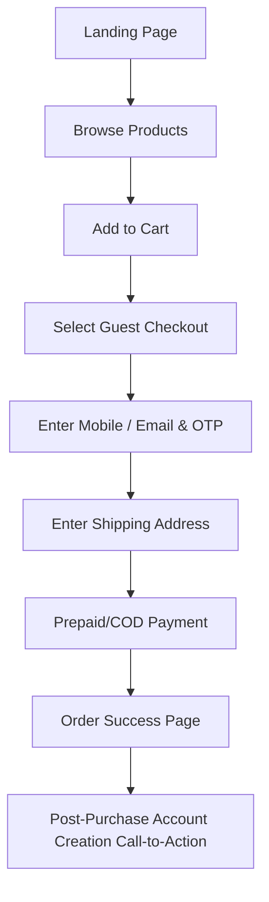
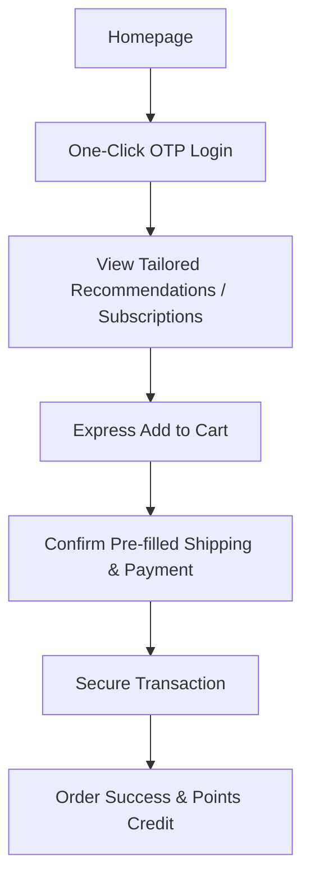

# Information Architecture & UX Blueprint

## Project: MR. BHARATH FOODS
**Document Version:** 1.2.0  
**Author:** Principal UX Architect & Enterprise Information Architect  
**Date:** June 6, 2026  
**Status:** Released for Development Review  

---

### Executive Summary

This document serves as the master blueprint for the Information Architecture (IA) and User Experience (UX) of the **MR. BHARATH FOODS** enterprise ecommerce platform. 

The architecture is designed to handle extreme scale—from launching with 2 Ghee SKUs to supporting hundreds of SKUs across multiple traditional and health food categories. Every component focuses on reinforcing brand pillars: **Trust, Quality, Responsibility, Corporate Professionalism, and Indian Heritage**.

---

## 1. Complete Sitemap

The system utilizes a clean hierarchy, segregating commerce, brand narrative, and user account nodes.

```
├── Homepage
├── Shop (Product Listing Page - PLP)
│   ├── Category Entity Pages (e.g., /shop/ghee, /shop/oils) [NEW]
│   ├── Compare Products Portal (e.g., /compare) [NEW]
│   ├── Ghee (Rasipuram Ghee, Uthukuli Ghee)
│   ├── Traditional Oils [Future Category]
│   ├── Honey [Future Category]
│   ├── Rice [Future Category]
│   ├── Spices [Future Category]
│   ├── Traditional Foods [Future Category]
│   └── Health Foods [Future Category]
├── Individual Product Detail Pages (PDP)
├── Trust Center Hub (/trust) [NEW]
│   ├── Laboratory Transparency Portal (Batch Lookup)
│   └── Partner Facility Audit log
├── Wellness & Heritage Blog
│   ├── Category: Traditional Recipes
│   ├── Category: Nutritional Science
│   └── Category: Sourcing Stories
├── B2B & Corporate Services
│   ├── Corporate Gifting Portal
│   ├── Bulk / Wholesale Trade Inquiry
│   └── Partner Manufacturer Portal
├── User Account Area
│   ├── Dashboard & Order History
│   ├── Recently Viewed Staple Registry [NEW]
│   ├── Subscription Manager
│   └── "Bharath Points" Rewards Ledger
├── Cart (Slide-over / Modal)
├── Checkout Flow (Multi-step Wizard)
└── Footer Support Nodes
    ├── About Us
    ├── Help Center & FAQs
    ├── Contact Us
    └── Legal (Privacy Policy, Terms of Service, FSSAI Registration, GST Disclosures)
```

---

## 2. Guest Customer Flow

Designed to minimize purchase friction and encourage cart conversion.



---

## 3. Registered Customer Flow

Optimized for speed, leveraging saved profile details.



---

## 4. Product Discovery Flow

Designed to educate consumers on ingredient purity before they commit to purchase.

* **Entry Point**: Home, Social Ad, or Blog.
* **Navigation**: User accesses Category Listing Page (CLP) or Product Listing Page (PLP).
* **Education Loop**: 
  - Visual display of quality credentials (e.g., "Pure A2 Certified").
  - Compare feature for Ghee varieties (Rasipuram vs. Uthukuli Ghee).
* **CTA**: 1-Click "Add to Cart" or "Set Up Staple Subscription."

---

## 5. Search Flow

* **Trigger**: Click on header search bar opens a full-screen overlay.
* **Instant States**: Displays "Recently Searched," "Trending Products," and "Curated Categories."
* **Active Typing**: Fuzzy search with real-time autocompletion, category matching, and inline product previews showing price and rating.
* **No Results State**: Smart fallback recommending popular staples (Ghee/Oils) based on geographical popularity.

---

## 6. Category Navigation Flow

* **Header Menu Hover**: Triggers a clean mega-menu detailing categories.
* **Visual Anchors**: Every category is paired with a micro line-art icon or high-end product thumbnail.
* **Sourcing Indicators**: Direct access links to specific regional sources (e.g., "Shop Rasipuram Region" or "Shop Uthukuli Region").

---

## 6a. Category Entity Page Architecture

Rather than standard, basic Product Listing Pages (PLPs), each category (e.g., `/shop/ghee`, `/shop/oils`) operates as an authority landing hub. This drives SEO indexation and customer education.

### Section Stack:
1. **Hero Panel**: A clean, premium editorial headline (e.g., "Uthukuli & Rasipuram Ghee: Pure Clarified Butter") set against a warm grey background, with brief historical/geographical context.
2. **"What is {Category}?" Section**: A text layout explaining the traditional extraction method (e.g., curd-churned Bilona Ghee vs. direct butter melting).
3. **Health & Culinary Benefits**: A visual grid summarizing health features (e.g., high smoke point, rich fat-soluble vitamins, gut health properties) optimized for search crawler indexing.
4. **Product Catalog Grid**: Active purchasing cards (Product Cards) with functional filter chips (size, variant, price).
5. **"Understanding the Varieties" Comparison Snippet**: A simple text comparison panel distinguishing the available regional varieties (e.g., why choose Uthukuli over Rasipuram Ghee).
6. **Category FAQs**: Expandable accordion questions focusing on the category (e.g., shelf life of ghee, refrigeration needs, jar sealing standards).
7. **Curated Recipe & Blog Grid**: Carousel showing recent articles featuring the category (e.g., "Traditional Mysore Pak Recipe using Uthukuli Ghee").
8. **Aggregated Category Reviews**: A section highlighting verified review score cards and customer-submitted photos.
9. **Related / Sibling Categories**: Dynamic internal links pointing to related staple categories (e.g., Cold-Pressed Oils, Wild Honey).

---

## 7. Product Page (PDP) Architecture

The PDP uses a layout structured to build customer trust:

```
┌─────────────────────────────────────────────────────────────────┐
│ Breadcrumbs: Shop > Ghee > Uthukuli Ghee                         │
├────────────────────────────────┬────────────────────────────────┤
│                                │ UTHUKULI GHEE                  │
│                                │ ★★★★★ (142 reviews)            │
│  [ Product Image Showcase ]    ├────────────────────────────────┤
│                                │ Sourced from grazing cows.     │
│  - 1:1 Aspect Ratio Studio     │                                │
│  - Zoom-in View                │ Volume: [ 250ml ] [ 500ml ]    │
│  - Video of Texture/Viscosity  ├────────────────────────────────┤
│                                │ ₹599.00                        │
│                                │ [ ADD TO CART ]                │
│                                │ [ SUBSCRIBE & SAVE 10% ]       │
├────────────────────────────────┴────────────────────────────────┤
│                                                                 │
│  TABBED SECTION:                                                │
│  [ Sourcing Details ] [ Lab Certificates ] [ Reviews & FAQs ]   │
│                                                                 │
│  - Sourcing Details: Sourcing maps, farmer spotlights.           │
│  - Lab Certificates: Downloadable PDF for active Batch UT-2026.  │
│  - Reviews: Customer photos, verified buyer reviews.           │
│                                                                 │
└─────────────────────────────────────────────────────────────────┘
```

---

## 7a. Compare Products Portal (/compare)

A side-by-side comparison matrix designed to assist users in selecting regional varieties.

```
       [ UTHUKULI GHEE ]           [ VS ]          [ RASIPURAM GHEE ]
       ┌───────────────┐                           ┌────────────────┐
       │  [Image A]    │                           │   [Image B]    │
       └───────────────┘                           └────────────────┘
       [ Add to Cart ]                             [ Add to Cart ]
```

### Attributes Comparison Matrix:
* **Aroma Profile**: Intense, granular-rich, traditional vs. Mild, sweet, light-buttery.
* **Color & Texture**: Deep golden-yellow, highly granular vs. Pale cream-yellow, fine-granular.
* **Sourcing Region**: Pasture-fed cattle in Coimbatore/Tiruppur district vs. Selected cooperative farms in Namakkal district.
* **Best Culinary Usage**: Hot steamed rice, direct ingestion, traditional Indian sweets vs. Shallow-frying, tempering, daily cooking staples.
* **Processing Standard**: Curd-churned cream butter base vs. Direct cream-butter clarified on regulated low heat.
* **Pricing (500ml)**: ₹599 vs. ₹549.
* **User Rating**: ★ 4.9 (142 reviews) vs. ★ 4.8 (98 reviews).

---

## 8. Cart Flow

* **Type**: Right-aligned slide-out cart overlay (Drawer) that opens without loading a new page.
* **Layout**:
  - Top: Cart item counter and clear close button.
  - Middle: Item list displaying product name, volume/weight, price, quantity selector, and remove link.
  - Bottom: Subtotal (including transparent note: "GST calculated at checkout"), promotional coupon input box, and Progress Bar for free shipping (e.g., *"Add ₹200 more for free delivery"*).
  - CTA: High-contrast "PROCEED TO CHECKOUT" button.

---

## 9. Checkout Flow

A 3-step, distraction-free wizard interface. The standard header/footer are hidden during checkout to prevent cart abandonment.

```
  [ STEP 1: Delivery ] ──► [ STEP 2: Verification ] ──► [ STEP 3: Payment ]
  - Name, Phone, Address   - OTP / COD Confirm         - UPI / Card / NetBanking
```

* **Step 1 (Delivery)**: Pincode checker triggers automatically to confirm serviceability. Pre-fills city/state from the India Post API.
* **Step 2 (Verification)**: Registered users verify via WhatsApp/SMS OTP. COD orders require active checkbox verification.
* **Step 3 (Payment)**: Features a pre-selected UPI option alongside saved cards, ensuring minimum taps on mobile devices.

---

## 10. Order Success Flow

Designed to provide immediate confirmation and initiate post-purchase trust building.

* **Main Panel**: Green success indicator checkmark, order number, estimated delivery date, and total amount paid.
* **Traceability Integration**: Direct link to the batch page: *"Your jar is from Batch UT-2026. View its laboratory certificate."*
* **Loyalty Credit**: Visual callout showing how many "Bharath Points" were earned on this order.

---

## 11. Order Tracking Flow

* **Notification**: WhatsApp/SMS contains a tracking link.
* **UX Layout**: A clean timeline visualizer showing:
  - `Order Confirmed` → `Packed & Quality Checked` (displaying batch ID) → `Shipped` → `Out for Delivery` → `Delivered`.
* **Action Block**: Dedicated button to contact support or download the official Tax Invoice.

---

## 12. Wishlist Flow

* **Trigger**: Heart icon present on product grids (hover state) and PDPs.
* **UX Rule**: Clicking add does not redirect the user; it shows a subtle toast notification: *"Added to Wishlist. View wishlist."*
* **Access**: Accessible via the user profile menu. Clean layout allowing users to add wishlisted items directly to their cart.

---

## 13. Subscription Flow

* **Selection**: User toggles between "One-time Purchase" and "Subscribe & Save (10% Off)" on the PDP.
* **Configuration**: Select frequency (e.g., "Every 30 Days").
* **Dashboard Control**: Subscribers can skip a delivery, change the next charge date, swap products, or cancel subscriptions without calling support.

---

## 14. Account Area Structure

The registered customer panel uses a clean dashboard layout, integrating a dedicated path to repeat purchases.

```
├── Account Dashboard Overview (Recent orders, active subscriptions)
├── [NEW] Recently Viewed Staple Registry
│   └── Horizontal carousel of last 5 products browsed with one-click reorder CTA
├── Order History (Detail logs with "Reorder in 1-Click" buttons)
├── Manage Subscriptions (Frequency controls, skip options, billing dates)
├── Saved Addresses (Manage billing and shipping destinations)
├── Bharath Points Ledger (Points balance, redemption history)
└── Security Settings (Manage OTP configurations and account deletion)
```

### Recently Viewed Widget Rules:
* Active on the Customer Account Dashboard and the bottom deck of Category Listing Pages.
* Displays: Small product thumbnail, title, volume weight, stock count, and active "Add to Cart" button.

---

## 15. Blog Architecture

Designed as an educational authority channel rather than simple filler content.

* **Editorial Sections**: Traditional Recipes, Health & Ayurveda, Partner Spotlights.
* **Interactive Element (Shop the Post)**: Blog posts featuring recipe instructions display sidebar cards of the required ingredients (e.g., Ghee, Oils) with immediate "Add to Cart" options.
* **Author Profiles**: Displays nutritionist/chef credentials to build Google E-E-A-T authority.

---

## 16. Sourcing & Quality Process Pages

 An educational portal focused on the brand positioning: **"Selecting the Best to Serve the Best"**.

* **Content Panels**:
  - Interactive map showing the regions of partner manufacturers (e.g., Rasipuram, Uthukuli).
  - Step-by-step Quality Audit workflow (Purity Testing, Packaging Hygiene, Batch Lab Certifications).
  - Batch Lookup Widget: Enter a batch code to view dates and raw materials details.

---

## 16a. Trust Center (/trust)

A dedicated consumer-facing page consolidating all quality proof and brand safety certifications to maximize customer confidence.

```
┌─────────────────────────────────────────────────────────────────┐
│                       TRUST CENTER PORTAL                       │
├─────────────────────────────────────────────────────────────────┤
│ [ Batch Lookup Widget ] -> Search lab reports by jar batch code  │
├─────────────────────────────────────────────────────────────────┤
│ 1. Quality Selection Process (Curation standards & audits)      │
│ 2. Active Batch Laboratory Certificates (Downloadable PDFs)     │
│ 3. Physical Packaging & Glass Jar Standards (Safety seals)      │
│ 4. Corporate Registrations (FSSAI Lic. numbers, AGMARK info)    │
│ 5. Co-Packer Facility Audit logs & certifications               │
│ 6. Quality FAQ Accordion (Safety, returns, tamper assurance)    │
│ 7. Return & Refund Guarantee Policies                           │
│ 8. Contact Quality Team (Direct escalation feedback form)       │
└─────────────────────────────────────────────────────────────────┘
```

* **Access**: Linked from Header utility links, Product Detail tab "Lab Certificates," and footer brand credentials sections.

---

## 17. About Pages

* **Narrative Focus**: The founders' vision for Indian heritage food curation.
* **Business Model Explanation**: Clear, honest explanation of why we partner with specialized manufacturers rather than building generic processing factories, establishing authority in quality assessment.

---

## 18. Contact Pages

* **Routing Sections**: Segregated forms for different inquiry types:
  - D2C Customer Support.
  - Corporate Gifting and Custom branding.
  - Retail/Wholesale inquiries.
  - Partner Manufacturer applications.
* **Support Integration**: WhatsApp support link and customer care numbers prominently displayed.

---

## 19. Help Center / FAQ Pages

* **Layout**: Categorized list of queries (Shipping, Subscriptions, Quality, COD & Payments).
* **Smart Search**: Dedicated search input bar inside the Help Center to auto-suggest relevant help articles.
* **Frictionless Support Escalation**: If the user marks a help article as "Not Helpful," display a quick form to message customer support.

---

## 20. Legal Pages

* **Clarity**: High-density text layout with summary callout boxes at the top explaining legal jargon in simple terms.
* **Key Nodes**: Privacy Policy (DPDP compliance), Terms of Service, Return/Refund Policy, FSSAI Registration disclosures, and corporate GST identification detail panels.

---

## 21. Desktop Navigation Structure

```
[ LOGO ]  Shop Ghee | Shop Oils | Shop Honey | Sourcing Story | Quality Portal
          ---------------------------------------------------------------
          [ Search Bar ] [ Support Link ] [ Wishlist ] [ Account ] [ Cart ]
```

* **Mega Menu Behavior**: Hovering over "Shop" categories opens a full-width dropdown showcasing product thumbnails, pricing, and a quick-add checkout button.

---

## 22. Mobile Navigation Structure

* **Top Bar**: Minimal layout containing Hamburger Menu (left), Logo (center), and Cart drawer icon (right).
* **Bottom Sticky Bar**: Sticky navigation at the bottom of the screen:
  - `Home` | `Search` | `Loyalty Account` | `Wishlist`.
* **Sidebar Menu**: Clean slide-in menu containing category links, Sourcing Stories, Corporate Gifting form, and language selector.

---

## 23. Footer Structure

* **Grid Layout**: 4 columns (Commerce, Quality/Trust, Corporate, Newsletter Subscription).
* **Trust Trustmarks**: Logos for FSSAI registration, Agmark, secure payment gateways, and shipping partners.
* **FSSAI Compliance Block**: Official FSSAI emblem, license numbers, and office addresses clearly printed at the bottom of the footer.

---

## 24. Search and Filter UX

* **Filter Placement**: Desktop uses a left-hand sticky filter panel; mobile uses a full-screen slide-up drawer.
* **Interactive Filters**: Dynamic sliders for price, checkbox groups for variants (A2, standard) and sizes (250ml, 500ml, 1L).
* **Instant Apply**: Filters apply dynamically using AJAX to update the product listing page without reloading the entire page.

---

## 25. Breadcrumb Strategy

* **Usage**: Active on all PDP, CLP, and blog post pages.
* **URL Alignment**: Breadcrumbs map directly to URL routes:
  - `Home > Shop > Ghee > Uthukuli Ghee` -> `/shop/ghee/uthukuli-ghee`
* **UX Value**: Provides clear context of location, allowing users to return to category levels in one click.

---

## 26. Future Category Hierarchy

The navigation tree is structured to scale smoothly to support hundreds of SKUs:

```
├── Category: Ghee (Cow Ghee, Buffalo Ghee, A2 Gir Ghee)
├── Category: Traditional Oils (Wood-Pressed Coconut, Sesame, Groundnut)
├── Category: Honey (Raw Honey, Wildflower Honey, Forest Honey)
├── Category: Heritage Rice (Mapillai Samba, Karuppu Kavuni, Basmati)
├── Category: Spices (Organic Turmeric, Cardamom, Black Pepper, Red Chili)
├── Category: Traditional Foods (Appalams, Pickles, Native Vathals)
└── Category: Health Foods (Millet Mixes, Herbal Infusions, Multi-Grain Flour)
```

---

## 27. B2B Flow

* **Entry Point**: Header link "Wholesale & B2B".
* **Dashboard**: Registered business accounts log into a portal to place bulk orders, upload company GSTINs for tax input credit, and view trade pricing tier lists.
* **Fulfillment Rules**: Custom bulk shipping estimates generated at checkout, with payment via NetBanking or business wire options.

---

## 28. Corporate Gifting Flow

* **UX Interface**: Visual page displaying curated gift boxes (e.g., "Heritage Festival Hamper").
* **Customization Module**: In-page step form enabling buyers to request custom branding designs, upload company logos, specify bulk quantities, and select multiple delivery addresses.

---

## 29. Bulk Order Flow

* **Quick Order Form**: A dedicated grid page displaying a row list of all products with volume counters. Corporate buyers can input order quantities in bulk and add them to their cart in a single click.

---

## 30. Admin Panel Information Architecture

The central dashboard for managing the e-commerce store is structured into the following modules:

```
├── Dashboard Overview (Sales, active shipments, fulfillment queue)
├── Catalog Manager (PIM)
│   ├── Products & Variant Schema
│   └── Sourcing & Quality Logs (Lab reports, Facility audits)
├── Orders & Shipments
│   ├── Order Status Queue (Pending, Paid, Shipped, Returned)
│   └── Carrier Allocations & Tracking
├── Customer Manager (CRM)
│   └── Subscription logs & Loyalty Accounts
└── Content Management System (CMS)
    ├── Blog & Recipe Editor
    └── Visual Homepage Banner config
```

---

## 31. Warehouse Panel IA

Optimized for mobile barcode scanners and packing lists:

```
├── Pick & Pack Queue (Sorted by order creation date, FIFO batch rules)
├── Inventory Inflow Registry (Register batch, expiry, partner manufacturer ID)
├── Expiry & Waste Manager (Alerts for stock within 60 days of expiry)
└── Return & Logistics Inspector (Check returns, verify item condition, process refunds)
```

---

## 32. Support Panel IA

For customer support agents managing active queries:

```
├── Ticket Center (Integrated inquiries from Email, WhatsApp, Web Form)
├── Order Modification Console (Edit customer shipping address, update tracking links)
├── Subscription Billing Controller (Process refunds, adjust billing dates, cancel subscriptions)
└── Loyalty adjustments (Manually credit points for customer feedback)
```

---

## 33. Analytics Dashboard IA

Designed to provide clear business insights:

```
├── Commerce Performance (Revenue, AOV, Conversion Rate, Cart Abandonment)
├── Retention & Cohort Logs (LTV, Subscription retention rates)
├── Product Performance Logs (Top-selling categories, return rates per SKU)
└── Quality & Audit Tracker (Batch failure rates, Partner manufacturer compliance logs)
```

---

## 34. Notification Center IA

Manages cross-channel communications to ensure customer updates are timely and clear:

* **Customer Channels**: Automated transactional notifications sent via WhatsApp, SMS, and Email for:
  - Order confirmed (with invoice PDF).
  - Shipped (with tracking details link).
  - Delivered (with survey feedback request).
  - Subscription upcoming charge alert (72 hours prior).
* **System Channels**: Automated Slack/Email alerts for the internal team on:
  - High RTO risk flagged orders.
  - Critical stock levels.
  - Partner audit compliance warning expirations.

---

## 35. SEO Hierarchy

The SEO strategy is structured to build search authority for food safety and heritage recipes:

* **Target Schema Markup (JSON-LD)**: Set on pages dynamically.
* **Product Detail Pages**: Optimized for keyword categories (e.g., "Buy pure Uthukuli Ghee online").
* **Category Listing Pages**: Optimized for regional curation searches (e.g., "Authentic Traditional Oils from Tamil Nadu").
* **Content Hub**: Internal links pointing directly from blog recipes to product purchasing pages.

---

## 36. Multi-Language Architecture

* **Framework**: Modular i18n structure.
* **User Interface**: Dropdown selector located in the header and footer.
* **Language Hierarchy**: Launches in **English (Global & Corporate)**, with translations for **Tamil** (local South Indian heritage sourcing alignment) and **Hindi** (broad national scale) to follow.

---

## 37. Error Pages

* **UX Rule**: Avoid generic technical error screens (like "404 Not Found").
* **Content**: Display a reassuring message matching the brand tone, combined with search bars and links to popular collections (e.g., "Return to Shop Ghee").
* **Server Errors (500)**: Display helpful customer support links and numbers alongside the error message.

---

## 38. Empty States

* **Triggers**: Empty Cart, No Search Results, No Orders in Account history.
* **Actionable Layouts**:
  - **Empty Cart**: Recommends best-sellers (Uthukuli Ghee) with a prominent "Start Shopping" button.
  - **No Search Results**: Displays popular search terms and recommended categories to keep the user engaged.

---

## 39. Loading States

* **Rules**: Minimize layout shifting during loading.
* **Implementations**:
  - **Skeleton screens**: Grey placeholder blocks mimicking the exact shape of product cards or table rows while fetching data.
  - **Progressive Loading**: Images load with low-res blur previews first, transitioning smoothly as assets load.

---

## 40. Future International Expansion UX

Designed to support international scaling to NRI (Non-Resident Indian) markets:

* **Dynamic Geolocation**: Detect user IP to automatically display pricing in local currencies (USD, CAD, AED, GBP) and adjust shipping estimates.
* **Global Shipping Calculations**: Integrates with international carrier APIs to calculate duties, customs clearances, and shipping rates directly in the checkout view.
* **International Subscriptions**: Adapts subscription options based on regional custom regulations for food imports.
